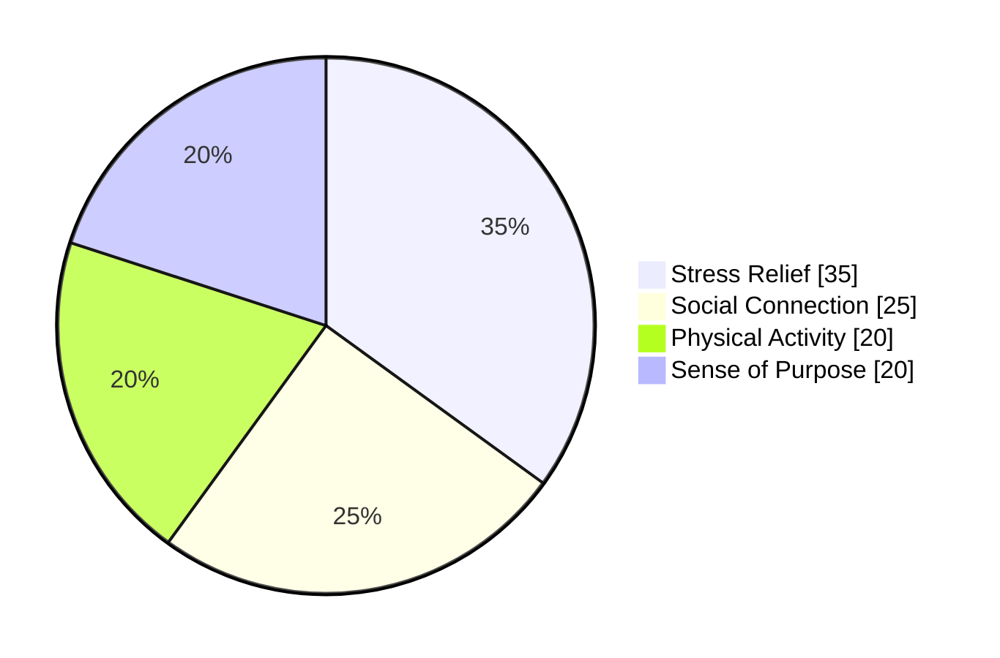

# Dogs Are The Best

### The pawsitive case for our four-legged sidekicks

  Tap the space bar to meet the doggos 🐶

---

# 🐾 Agenda

1. Why dogs are the best companions
2. Why humans genuinely _need_ dogs
3. Fun & funny dog facts you can drop anywhere
4. A tail-wagging conclusion (with a divine twist)

::right::

> "Dogs do speak, but only to those who know how to listen."
>
> — Orhan Pamuk

---

layout: center
class: text-left
background: https://images.unsplash.com/photo-1517849845537-4d257902454a?auto=format&fit=crop&w=1600&q=80
mask: rgba(10,10,10,0.45)
transition: fade-out

---

# Why Dogs Are The Best 🏆

<v-clicks>
- Built-in hype squad — they greet you like a celebrity every time you walk in.
- Natural therapists — petting a dog lowers cortisol and boosts oxytocin.
- Adventure buddies — rain or shine, they remind us to explore and play.
- Empathy engines — many can sense moods and adjust their behavior to comfort us.
</v-clicks>

> Studies show dog owners walk 2,760 more steps _per week_ on average — that adds up!

---

# Why Humans Need Dogs 🤝

<v-clicks depth="2">
- **Physical health:** Boosts daily movement, encourages outdoor time, and can lower blood pressure.
- **Mental health:** Companionship combats loneliness, reducing depression and anxiety risk.
- **Social life:** Dogs are conversation starters and community builders at parks and events.
- **Purpose:** Daily caregiving routines provide structure, responsibility, and pride.
</v-clicks>

::right::

---

layout: image-right
image: https://images.unsplash.com/photo-1507146426996-ef05306b995a?auto=format&fit=crop&w=1200&q=80
class: text-left

---

# Science-Backed Benefits 🔬

- 24% lower mortality risk for dog owners according to the American Heart Association.
- Therapy dogs cut test anxiety in students by up to 45% in recent university trials.
- Search-and-rescue dogs can smell a teaspoon of sugar in a million gallons of water.
- Service dogs restore independence for people with PTSD, autism, and mobility challenges.

> TL;DR: Dogs aren't just cute — they're life-improving technology wrapped in fur.

---

# Fun Dog Facts 🎉

<v-clicks>
- Dogs’ noses print unique patterns — think "paw-thentication" instead of fingerprints.
- Basenjis *yodel* instead of bark thanks to their larynx shape.
- Newfoundlands have webbed feet built for lifesaving water rescues.
- A Greyhound can beat a Cheetah in a **long-distance** race.
</v-clicks>

::right::

---

# Funny Dog Truths 😂

<v-clicks>
- The zoomies are just dogs buffering their excitement in real time.
- Every squeaky toy is an undercover squeal-detector mission.
- Dogs don't understand personal space — only *person space* (a lap).
- They'll judge you for eating without sharing but still lick the empty plate.
</v-clicks>

::right::

> "I work hard so my dog can live its best life."
>
> — Every dog parent ever

---

layout: center
class: text-center text-5xl font-bold tracking-tight
background: https://images.unsplash.com/photo-1541364983171-a8ba01e95cfc?auto=format&fit=crop&w=1600&q=80
mask: linear-gradient(135deg, rgba(0,0,0,0.6), rgba(30,30,30,0.4))
transition: fade-up

---

DOG IS GOD SPELLED BACKWARDS 🙏🐕

  Because unconditional love is the closest thing to heaven on Earth.

---

layout: two-cols
layoutClass: gap-12 items-center

---

# Humans + Dogs = Better Together

<v-clicks>
- Foster programs prove that even short-term care changes lives on both ends of the leash.
- Office dogs boost morale, reduce burnout, and make Mondays tolerable.
- Family dogs teach empathy, responsibility, and the magic of loyalty to kids.
- Adopt, volunteer, donate — every action fuels the dog-human bond.
</v-clicks>

::right::

---

layout: center
class: text-center

---

# Thanks for Wagging Along 🐾

- Share a dog story with someone today.
- Support your local shelters and rescue groups.
- Remember: happiness is measured in tail wags per minute.
